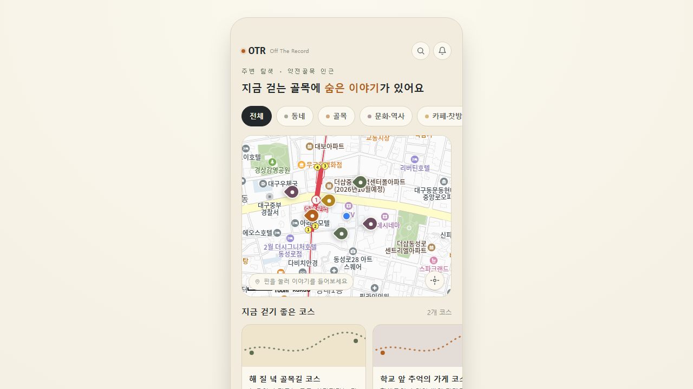

# OTR — Off The Record

동네 골목과 오래된 가게에 숨은 이야기를, 걸으면서 오디오로 들려주는 **하이퍼로컬 오디오 가이드 앱**입니다.



## 이런 서비스예요

- 지도에서 내 주변의 "스팟"(동네 이야기가 있는 가게·골목)을 둘러볼 수 있어요.
- 스팟을 누르면 그 장소에 얽힌 이야기를 짧은 오디오로 들을 수 있어요.
- 여러 스팟을 이어 걷는 추천 "코스"를 따라 골목 산책을 할 수 있어요.
- 카테고리(동네 / 골목 / 문화·역사 / 카페·찻방)로 필터링해서 원하는 이야기만 골라볼 수 있어요.

## 주요 기능

- 실제 카카오맵 기반 지도 + 브라우저 위치 권한을 허용하면 내 현재 위치 표시
- 스팟 핀을 눌러 상세 설명과 오디오 미리듣기
- 여러 스팟을 묶은 추천 걷기 코스 열람
- 카테고리별 필터링

## 기술 스택

- [Next.js](https://nextjs.org) 14 (App Router)
- React 18 + TypeScript
- Tailwind CSS
- [카카오맵 JavaScript SDK](https://apis.map.kakao.com)

## 시작하기 (로컬 개발)

1. 저장소를 내려받고 폴더로 이동
   ```bash
   npm install
   ```
2. 프로젝트 루트에 `.env.local` 파일을 만들고 카카오맵 JavaScript 키를 등록
   ```
   NEXT_PUBLIC_KAKAO_MAP_KEY=발급받은_카카오_JavaScript_키
   ```
   (키 발급 및 도메인 등록 방법은 [develop.md](develop.md) 참고)
3. 개발 서버 실행
   ```bash
   npm run dev
   ```
4. 브라우저에서 `http://localhost:3000` 접속

## 폴더 구조

```
app/                  Next.js 페이지 (화면 단위)
  page.tsx            메인 홈 화면 (지도 + 카테고리 필터 + 코스 목록)
components/otr/       화면을 구성하는 UI 컴포넌트
  LocalMap.tsx         카카오맵 연동 지도 컴포넌트
  SpotSheet.tsx        스팟(가게) 상세 + 오디오 재생 바텀시트
  CourseSheet.tsx      추천 코스 상세 바텀시트
data/otr/              스팟, 코스 데이터
  spots.ts             동네 스팟 목록 (위치, 카테고리, 설명, 오디오 길이)
  courses.ts           추천 걷기 코스 목록
```

## 개발 기록

프로젝트를 만들며 무엇을, 왜 바꿨는지는 [develop.md](develop.md)에서 계속 갱신하고 있어요.
